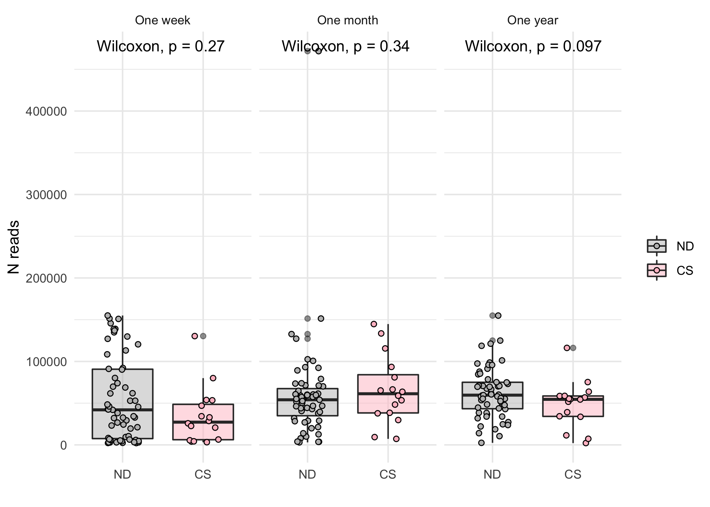
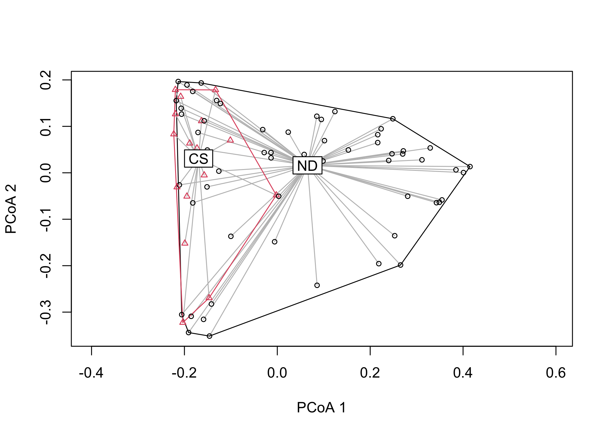
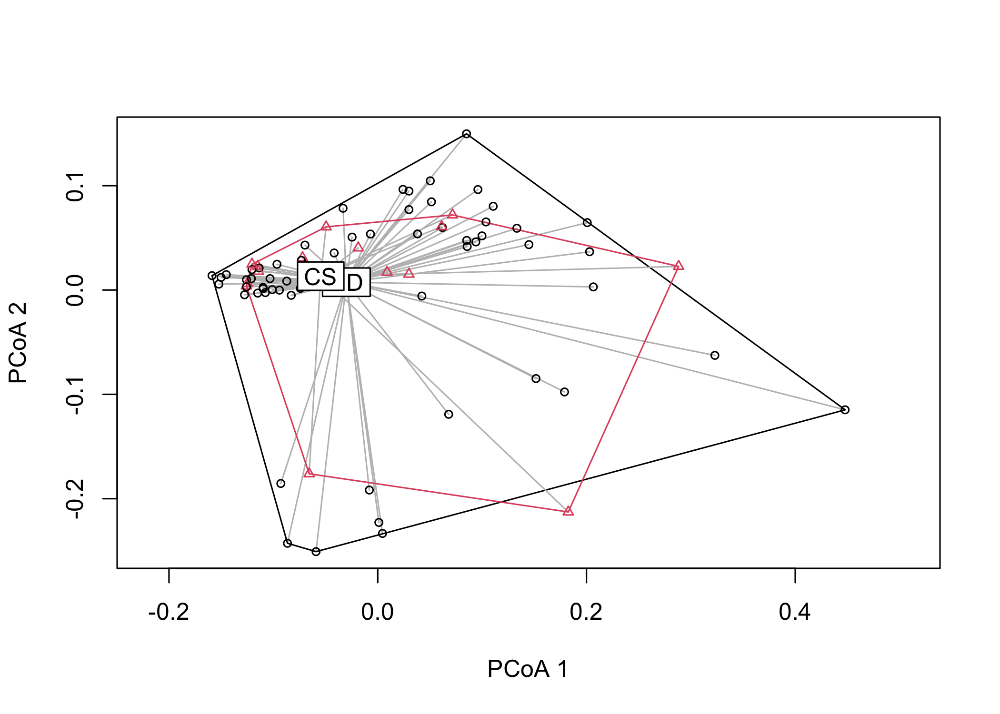
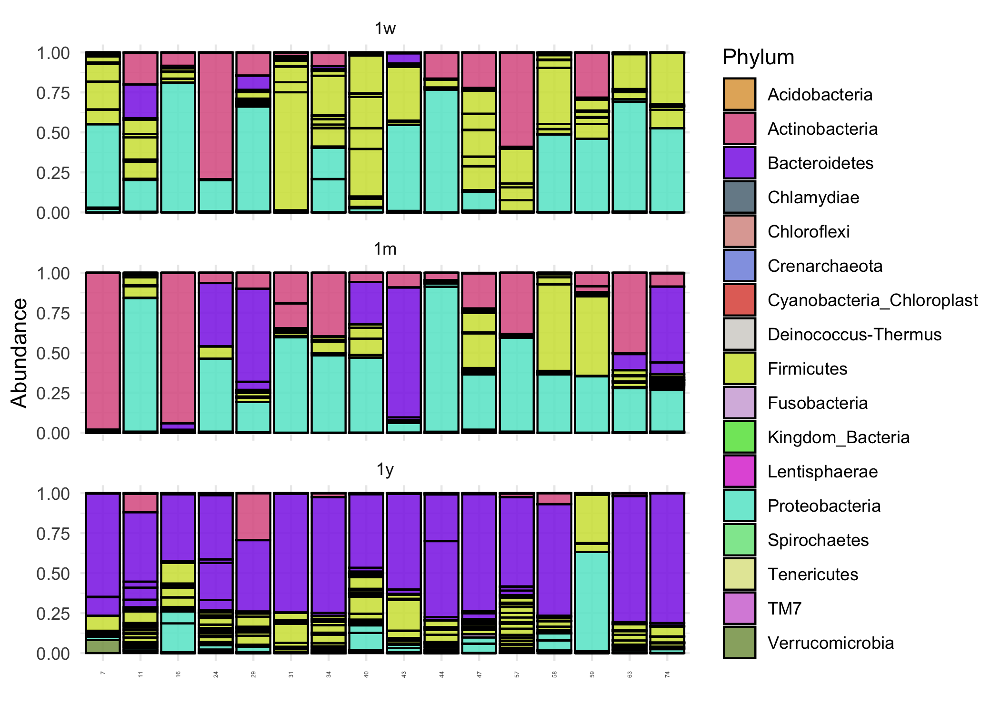

<style>
body{ /* Normal  */
      font-size: 14px;
      text-align: justify;
  }
td {  /* Table  */
  font-size: 8px;
}
</style>

Exploratory analysis
====================

``` r
# Print phyloseq object
test_set
```

    ## phyloseq-class experiment-level object
    ## otu_table()   OTU Table:         [ 2747 taxa and 225 samples ]
    ## sample_data() Sample Data:       [ 225 samples by 5 sample variables ]
    ## tax_table()   Taxonomy Table:    [ 2747 taxa by 7 taxonomic ranks ]
    ## phy_tree()    Phylogenetic Tree: [ 2747 tips and 2746 internal nodes ]

``` r
summarize_phyloseq(test_set)
```

    ## [[1]]
    ## [1] "1] Min. number of reads = 2202"
    ## 
    ## [[2]]
    ## [1] "2] Max. number of reads = 471764"
    ## 
    ## [[3]]
    ## [1] "3] Total number of reads = 12813225"
    ## 
    ## [[4]]
    ## [1] "4] Average number of reads = 56947.6666666667"
    ## 
    ## [[5]]
    ## [1] "5] Median number of reads = 52914"
    ## 
    ## [[6]]
    ## [1] "7] Sparsity = 0.924722727824293"
    ## 
    ## [[7]]
    ## [1] "6] Any OTU sum to 1 or less? YES"
    ## 
    ## [[8]]
    ## [1] "8] Number of singletons = 481"
    ## 
    ## [[9]]
    ## [1] "9] Percent of OTUs that are singletons \n        (i.e. exactly one read detected across all samples)17.5100109210047"
    ## 
    ## [[10]]
    ## [1] "10] Number of sample variables are: 5"
    ## 
    ## [[11]]
    ## [1] "ID"          "Time"        "CS_delivery" "delivery"    "group"

``` r
# describe raw data
df = colSums(otu_table(test_set)) %>%
  data.frame() %>%
  magrittr::set_colnames(c("reads")) %>%
  cbind(sample_data(test_set))
```

Describe raw reads
------------------

``` r
# barplots with N reads per sample
ggplot(df, aes(x=ID, y=reads, fill=delivery)) +
  geom_col(color="black") +
  xlab("Sample") + ylab("N reads") +
  scale_fill_manual("", values=delivery_color) +
  coord_flip() +
  facet_wrap(~Time, labeller=labeller(Time = c("1w"="One week",
                                        "1m"="One month",
                                        "1y"="One year"))) +
  theme_minimal(base_size=8)
```


``` r
ggsave("outputs/nreads_barplots.pdf", device="pdf", w=10, h=6)

# N reads by delivery type 
ggplot(df, aes(x=delivery, y=reads, fill=delivery)) +
  geom_boxplot(alpha=.5) +
  geom_point(position=position_jitter(w=0.2, h=0.1), pch=21) +
  stat_compare_means(method="wilcox.test") +
  xlab("") + ylab("N reads") +
  scale_fill_manual("", values=delivery_color) +
  facet_wrap(~Time, labeller=labeller(Time = c("1w"="One week",
                                               "1m"="One month",
                                               "1y"="One year")))
```



``` r
ggsave("outputs/nreads_boxplots_delivery_time.pdf", device="pdf", w=8, h=4)

# N reads by time point
my_comparisons = list( c("1w", "1m"), c("1w", "1y"), c("1m", "1y"))
ggplot(df, aes(x=Time, y=reads, fill=Time)) +
  geom_boxplot(alpha=.5) +
  geom_point(position=position_jitter(w=0.2, h=0.1), pch=21) +
  stat_compare_means(method="wilcox.test", ref.group="1w",
                     comparisons = my_comparisons) +
  xlab("") + ylab("N reads") +
  scale_x_discrete(labels=c("1w" = "One week",
                            "1m" = "One month",
                            "1y" = "One year")) +
  scale_fill_manual("", values=time_color)
```


``` r
ggsave("outputs/nreads_boxplots_time.pdf", device="pdf", w=5, h=4)

# N reads by phylum
df = reshape2::melt(t(otu_table(test_set))) %>%
  magrittr::set_names(c("Sample", "OTU", "value"))
taxdata = data.frame(tax_table(test_set)) %>%
  mutate(OTU = rownames(.))

dfm = merge(df, taxdata, by = "OTU") %>%
  group_by(Phylum) %>%
  mutate(mean = mean(value))

ggplot(dfm, aes(x=fct_reorder(Phylum, mean), y=value, color = Phylum)) + 
  geom_point(size = 1, alpha = .7, position = position_jitter(h=0, w=0.2)) +
  ylab("Counts") + xlab("Phylum") +
  guides(color = FALSE) +
  scale_color_manual(values=phylum_color) +
  coord_flip()
```


``` r
ggsave("outputs/sample_reads_raw_phylum.pdf", w=7, h=4)

print(filter_taxa(test_set, function(x) sum(x) > 0, TRUE))
```

    ## phyloseq-class experiment-level object
    ## otu_table()   OTU Table:         [ 2747 taxa and 225 samples ]
    ## sample_data() Sample Data:       [ 225 samples by 5 sample variables ]
    ## tax_table()   Taxonomy Table:    [ 2747 taxa by 7 taxonomic ranks ]
    ## phy_tree()    Phylogenetic Tree: [ 2747 tips and 2746 internal nodes ]

Describe N taxa for each delivery - time point
----------------------------------------------

``` r
# phyloseq object
print(filter_taxa(test_set, function(x) sum(x) > 0, TRUE))
```

    ## phyloseq-class experiment-level object
    ## otu_table()   OTU Table:         [ 2747 taxa and 225 samples ]
    ## sample_data() Sample Data:       [ 225 samples by 5 sample variables ]
    ## tax_table()   Taxonomy Table:    [ 2747 taxa by 7 taxonomic ranks ]
    ## phy_tree()    Phylogenetic Tree: [ 2747 tips and 2746 internal nodes ]

``` r
# phyloseq object: natural delivery
print(filter_taxa(subset_samples(test_set, CS_delivery == 0), function(x) sum(x) > 0, TRUE))
```

    ## phyloseq-class experiment-level object
    ## otu_table()   OTU Table:         [ 2562 taxa and 177 samples ]
    ## sample_data() Sample Data:       [ 177 samples by 5 sample variables ]
    ## tax_table()   Taxonomy Table:    [ 2562 taxa by 7 taxonomic ranks ]
    ## phy_tree()    Phylogenetic Tree: [ 2562 tips and 2561 internal nodes ]

``` r
# phyloseq object: natural delivery at 1 week
print(filter_taxa(subset_samples(subset_samples(test_set, CS_delivery == 0), Time == "1w"),
                  function(x) sum(x) > 0, TRUE))
```

    ## phyloseq-class experiment-level object
    ## otu_table()   OTU Table:         [ 1413 taxa and 59 samples ]
    ## sample_data() Sample Data:       [ 59 samples by 5 sample variables ]
    ## tax_table()   Taxonomy Table:    [ 1413 taxa by 7 taxonomic ranks ]
    ## phy_tree()    Phylogenetic Tree: [ 1413 tips and 1412 internal nodes ]

``` r
# phyloseq object: natural delivery at 1 month
print(filter_taxa(test_set, function(x) sum(x) > 0, TRUE))
```

    ## phyloseq-class experiment-level object
    ## otu_table()   OTU Table:         [ 2747 taxa and 225 samples ]
    ## sample_data() Sample Data:       [ 225 samples by 5 sample variables ]
    ## tax_table()   Taxonomy Table:    [ 2747 taxa by 7 taxonomic ranks ]
    ## phy_tree()    Phylogenetic Tree: [ 2747 tips and 2746 internal nodes ]

``` r
print(filter_taxa(subset_samples(subset_samples(test_set, CS_delivery == 0), Time == "1m"),
                  function(x) sum(x) > 0, TRUE))
```

    ## phyloseq-class experiment-level object
    ## otu_table()   OTU Table:         [ 1139 taxa and 59 samples ]
    ## sample_data() Sample Data:       [ 59 samples by 5 sample variables ]
    ## tax_table()   Taxonomy Table:    [ 1139 taxa by 7 taxonomic ranks ]
    ## phy_tree()    Phylogenetic Tree: [ 1139 tips and 1138 internal nodes ]

``` r
# phyloseq object: natural delivery at 1 year
print(filter_taxa(test_set, function(x) sum(x) > 0, TRUE))
```

    ## phyloseq-class experiment-level object
    ## otu_table()   OTU Table:         [ 2747 taxa and 225 samples ]
    ## sample_data() Sample Data:       [ 225 samples by 5 sample variables ]
    ## tax_table()   Taxonomy Table:    [ 2747 taxa by 7 taxonomic ranks ]
    ## phy_tree()    Phylogenetic Tree: [ 2747 tips and 2746 internal nodes ]

``` r
print(filter_taxa(subset_samples(subset_samples(test_set, CS_delivery == 0), Time == "1y"),
                  function(x) sum(x) > 0, TRUE))
```

    ## phyloseq-class experiment-level object
    ## otu_table()   OTU Table:         [ 1881 taxa and 59 samples ]
    ## sample_data() Sample Data:       [ 59 samples by 5 sample variables ]
    ## tax_table()   Taxonomy Table:    [ 1881 taxa by 7 taxonomic ranks ]
    ## phy_tree()    Phylogenetic Tree: [ 1881 tips and 1880 internal nodes ]

``` r
# phyloseq object: c-section
print(filter_taxa(subset_samples(test_set, CS_delivery == 1), function(x) sum(x) > 0, TRUE))
```

    ## phyloseq-class experiment-level object
    ## otu_table()   OTU Table:         [ 1703 taxa and 48 samples ]
    ## sample_data() Sample Data:       [ 48 samples by 5 sample variables ]
    ## tax_table()   Taxonomy Table:    [ 1703 taxa by 7 taxonomic ranks ]
    ## phy_tree()    Phylogenetic Tree: [ 1703 tips and 1702 internal nodes ]

``` r
# phyloseq object: c-section at 1 week
print(filter_taxa(subset_samples(subset_samples(test_set, CS_delivery == 1), Time == "1w"),
                  function(x) sum(x) > 0, TRUE))
```

    ## phyloseq-class experiment-level object
    ## otu_table()   OTU Table:         [ 674 taxa and 16 samples ]
    ## sample_data() Sample Data:       [ 16 samples by 5 sample variables ]
    ## tax_table()   Taxonomy Table:    [ 674 taxa by 7 taxonomic ranks ]
    ## phy_tree()    Phylogenetic Tree: [ 674 tips and 673 internal nodes ]

``` r
# phyloseq object: c-section at 1 month
print(filter_taxa(subset_samples(subset_samples(test_set, CS_delivery == 1), Time == "1m"),
                  function(x) sum(x) > 0, TRUE))
```

    ## phyloseq-class experiment-level object
    ## otu_table()   OTU Table:         [ 675 taxa and 16 samples ]
    ## sample_data() Sample Data:       [ 16 samples by 5 sample variables ]
    ## tax_table()   Taxonomy Table:    [ 675 taxa by 7 taxonomic ranks ]
    ## phy_tree()    Phylogenetic Tree: [ 675 tips and 674 internal nodes ]

``` r
# phyloseq object: c-section at 1 year
print(filter_taxa(subset_samples(subset_samples(test_set, CS_delivery == 1), Time == "1y"),
                  function(x) sum(x) > 0, TRUE))
```

    ## phyloseq-class experiment-level object
    ## otu_table()   OTU Table:         [ 1355 taxa and 16 samples ]
    ## sample_data() Sample Data:       [ 16 samples by 5 sample variables ]
    ## tax_table()   Taxonomy Table:    [ 1355 taxa by 7 taxonomic ranks ]
    ## phy_tree()    Phylogenetic Tree: [ 1355 tips and 1354 internal nodes ]

Quality control
===============

Sample distances
----------------

``` r
samplenames = paste0(sample_data(test_set)$CS_delivery, "_", rownames(sample_data(test_set)))
names(samplenames) = rownames(sample_data(test_set))

tr = t(otu_table(test_set)) # transpose count matrix
rownames(tr) = samplenames[rownames(tr)] # add delivery info
hc = hclust(dist(tr), method = "ward.D2")

groups = paste0(substr(hc$labels,1,1), "_", substr(hc$labels,nchar(hc$labels)-1,nchar(hc$labels)))

myplclust(hc, labels = hc$labels,
          lab.col = as.fumeric(groups), cex=0.4)
```


Singletons
----------

``` r
# Are singletons, doubletons only of a specific species/Phyla? 
#  Phyla are ordered decreasingly from top to bottom by their mean number or reads. Each circle represents an OTU, and coloured indicate singleton OTU (1 read across all samples) or 0 reads. Counts above the mean are not shown for visualisation.  
otu = reshape2::melt(rowSums(otu_table(test_set)))
tax = data.frame(tax_table(test_set))
dfm = merge(otu, tax, by=0)
dfm = dfm %>% 
  group_by(Phylum) %>%
  mutate(mean = mean(value))

ggplot(dfm, aes(x=fct_reorder(Phylum, mean), y=value)) + 
  geom_point(size = 2, color = "gray", alpha = .7, position = position_jitter(h=0, w=0.2)) +
  geom_point(data = subset(dfm, value <= 2), color = "#d1495b",
             size = 2, alpha = .7, position = position_jitter(h=0.1, w=0.2)) +
  ylab("Counts") + xlab("Phylum") +
  ylim(0, mean(dfm$value)) +
  guides(color = FALSE) +
  coord_flip()
```


``` r
# by delivery mode
cs = subset_samples(test_set, CS_delivery == "1")
nat = subset_samples(test_set, CS_delivery == "0")

df_cs = reshape2::melt(rowSums(otu_table(cs)))
dfm_cs = merge(df_cs, data.frame(tax_table(cs)), by = 0)
dfm_cs$delivery = 'CS'
df_nat = reshape2::melt(rowSums(otu_table(nat)))
dfm_nat = merge(df_nat, data.frame(tax_table(nat)), by = 0)
dfm_nat$delivery = 'ND'
df_samples = rbind(dfm_cs, dfm_nat)
df_samples = df_samples %>% 
  group_by(Phylum, delivery) %>%
  mutate(mean = mean(value))

ggplot(df_samples, aes(x=fct_reorder(Phylum, mean), y=value, color=Phylum)) + 
  geom_point(size = 2, color = "gray", alpha = .7, position = position_jitter(h=0, w=0.2)) +
  geom_point(data = subset(dfm, value <= 1), color = "#d1495b",
             size = 2, alpha = .7, position = position_jitter(h=0.1, w=0.2)) +
  ylab("Counts") + xlab("Phylum") +
  ylim(0, mean(df_samples$value)) +
  coord_flip() +
  guides(color = FALSE) +
  facet_wrap(~delivery, scales="free_x")
```


Filters
=======

Filter 1: Remove singletons, doubletons
---------------------------------------

``` r
test_set.rm = filter_taxa(test_set, function(x) sum(x) > 2, TRUE)
test_set.rm
```

    ## phyloseq-class experiment-level object
    ## otu_table()   OTU Table:         [ 2023 taxa and 225 samples ]
    ## sample_data() Sample Data:       [ 225 samples by 5 sample variables ]
    ## tax_table()   Taxonomy Table:    [ 2023 taxa by 7 taxonomic ranks ]
    ## phy_tree()    Phylogenetic Tree: [ 2023 tips and 2022 internal nodes ]

Filter 2: Agglomerate OTUs by genus
-----------------------------------

``` r
#test_set.agg = tip_glom(test_set.rm, h=0.05) # uses agglomerative nesting (method=agnes)
test_set.agg = tax_glom(test_set.rm, "Genus") 
test_set.agg
```

    ## phyloseq-class experiment-level object
    ## otu_table()   OTU Table:         [ 275 taxa and 225 samples ]
    ## sample_data() Sample Data:       [ 225 samples by 5 sample variables ]
    ## tax_table()   Taxonomy Table:    [ 275 taxa by 7 taxonomic ranks ]
    ## phy_tree()    Phylogenetic Tree: [ 275 tips and 274 internal nodes ]

``` r
traw = plot_tree(test_set.rm, method="treeonly", ladderize = "left", sizebase = 0)
tfilt = plot_tree(test_set.agg, method="treeonly", ladderize = "left", sizebase = 0)
cowplot::plot_grid(traw, tfilt, labels=c("Before agglomeration", "After agglomeration"))
```


``` r
ggsave("outputs/agglomeration_trees.pdf", device="pdf", w=7, h=8)
```

Filter 3: Normalise counts
--------------------------

``` r
test_set.norm = transform_sample_counts(test_set.agg, function(x) x/sum(x))
test_set.norm
```

    ## phyloseq-class experiment-level object
    ## otu_table()   OTU Table:         [ 275 taxa and 225 samples ]
    ## sample_data() Sample Data:       [ 225 samples by 5 sample variables ]
    ## tax_table()   Taxonomy Table:    [ 275 taxa by 7 taxonomic ranks ]
    ## phy_tree()    Phylogenetic Tree: [ 275 tips and 274 internal nodes ]

Filter 4: Subset OTUs with \>0.01% in ≥ 2 samples
-------------------------------------------------

``` r
require(genefilter)
flist = filterfun(kOverA(2, 0.01))
check = test_set.f1 = filter_taxa(test_set.norm, flist)
test_set.f = filter_taxa(test_set.norm, flist, TRUE)
test_set.f
```

    ## phyloseq-class experiment-level object
    ## otu_table()   OTU Table:         [ 50 taxa and 225 samples ]
    ## sample_data() Sample Data:       [ 225 samples by 5 sample variables ]
    ## tax_table()   Taxonomy Table:    [ 50 taxa by 7 taxonomic ranks ]
    ## phy_tree()    Phylogenetic Tree: [ 50 tips and 49 internal nodes ]

Describe reads after filtering
==============================

``` r
# phyloseq object
print(test_set.norm)
```

    ## phyloseq-class experiment-level object
    ## otu_table()   OTU Table:         [ 275 taxa and 225 samples ]
    ## sample_data() Sample Data:       [ 225 samples by 5 sample variables ]
    ## tax_table()   Taxonomy Table:    [ 275 taxa by 7 taxonomic ranks ]
    ## phy_tree()    Phylogenetic Tree: [ 275 tips and 274 internal nodes ]

``` r
# phyloseq object: natural delivery
print(filter_taxa(subset_samples(test_set.norm, CS_delivery == 0), function(x) sum(x) > 0, TRUE))
```

    ## phyloseq-class experiment-level object
    ## otu_table()   OTU Table:         [ 268 taxa and 177 samples ]
    ## sample_data() Sample Data:       [ 177 samples by 5 sample variables ]
    ## tax_table()   Taxonomy Table:    [ 268 taxa by 7 taxonomic ranks ]
    ## phy_tree()    Phylogenetic Tree: [ 268 tips and 267 internal nodes ]

``` r
# phyloseq object: natural delivery at 1 week
print(filter_taxa(subset_samples(test_set.norm, group == "CS_1w"), function(x) sum(x) > 0, TRUE))
```

    ## phyloseq-class experiment-level object
    ## otu_table()   OTU Table:         [ 149 taxa and 16 samples ]
    ## sample_data() Sample Data:       [ 16 samples by 5 sample variables ]
    ## tax_table()   Taxonomy Table:    [ 149 taxa by 7 taxonomic ranks ]
    ## phy_tree()    Phylogenetic Tree: [ 149 tips and 148 internal nodes ]

``` r
# phyloseq object: natural delivery at 1 month
print(filter_taxa(subset_samples(subset_samples(test_set.norm, CS_delivery == 0), Time == "1m"), function(x) sum(x) > 0, TRUE))
```

    ## phyloseq-class experiment-level object
    ## otu_table()   OTU Table:         [ 195 taxa and 59 samples ]
    ## sample_data() Sample Data:       [ 59 samples by 5 sample variables ]
    ## tax_table()   Taxonomy Table:    [ 195 taxa by 7 taxonomic ranks ]
    ## phy_tree()    Phylogenetic Tree: [ 195 tips and 194 internal nodes ]

``` r
# phyloseq object: natural delivery at 1 year
print(filter_taxa(subset_samples(subset_samples(test_set.norm, CS_delivery == 0), Time == "1y"), function(x) sum(x) > 0, TRUE))
```

    ## phyloseq-class experiment-level object
    ## otu_table()   OTU Table:         [ 189 taxa and 59 samples ]
    ## sample_data() Sample Data:       [ 59 samples by 5 sample variables ]
    ## tax_table()   Taxonomy Table:    [ 189 taxa by 7 taxonomic ranks ]
    ## phy_tree()    Phylogenetic Tree: [ 189 tips and 188 internal nodes ]

``` r
# phyloseq object: c-section
print(filter_taxa(subset_samples(test_set.norm, CS_delivery == 1), function(x) sum(x) > 0, TRUE))
```

    ## phyloseq-class experiment-level object
    ## otu_table()   OTU Table:         [ 217 taxa and 48 samples ]
    ## sample_data() Sample Data:       [ 48 samples by 5 sample variables ]
    ## tax_table()   Taxonomy Table:    [ 217 taxa by 7 taxonomic ranks ]
    ## phy_tree()    Phylogenetic Tree: [ 217 tips and 216 internal nodes ]

``` r
# phyloseq object: c-section at 1 week
print(filter_taxa(subset_samples(subset_samples(test_set.norm, CS_delivery == 1), Time == "1w"), function(x) sum(x) > 0, TRUE))
```

    ## phyloseq-class experiment-level object
    ## otu_table()   OTU Table:         [ 149 taxa and 16 samples ]
    ## sample_data() Sample Data:       [ 16 samples by 5 sample variables ]
    ## tax_table()   Taxonomy Table:    [ 149 taxa by 7 taxonomic ranks ]
    ## phy_tree()    Phylogenetic Tree: [ 149 tips and 148 internal nodes ]

``` r
# phyloseq object: c-section at 1 month
print(filter_taxa(subset_samples(subset_samples(test_set.norm, CS_delivery == 1), Time == "1m"), function(x) sum(x) > 0, TRUE))
```

    ## phyloseq-class experiment-level object
    ## otu_table()   OTU Table:         [ 133 taxa and 16 samples ]
    ## sample_data() Sample Data:       [ 16 samples by 5 sample variables ]
    ## tax_table()   Taxonomy Table:    [ 133 taxa by 7 taxonomic ranks ]
    ## phy_tree()    Phylogenetic Tree: [ 133 tips and 132 internal nodes ]

``` r
# phyloseq object: c-section at 1 year
print(filter_taxa(subset_samples(subset_samples(test_set.norm, CS_delivery == 1), Time == "1y"), function(x) sum(x) > 0, TRUE))
```

    ## phyloseq-class experiment-level object
    ## otu_table()   OTU Table:         [ 151 taxa and 16 samples ]
    ## sample_data() Sample Data:       [ 16 samples by 5 sample variables ]
    ## tax_table()   Taxonomy Table:    [ 151 taxa by 7 taxonomic ranks ]
    ## phy_tree()    Phylogenetic Tree: [ 151 tips and 150 internal nodes ]

Coverage
========

``` r
raw_total_reads = sum(colSums(otu_table(test_set)))
print(paste0("Raw N total reads: ", raw_total_reads))
```

    ## [1] "Raw N total reads: 12813225"

``` r
filtered_total_reads = sum(colSums(otu_table(test_set.agg)))
print(paste0("Filtered N total reads: ", filtered_total_reads))
```

    ## [1] "Filtered N total reads: 12812258"

``` r
print("Summary read coverage raw")
```

    ## [1] "Summary read coverage raw"

``` r
coverage = metagMisc::phyloseq_coverage(test_set)
print(summary(coverage$SampleCoverage))
```

    ##    Min. 1st Qu.  Median    Mean 3rd Qu.    Max. 
    ##  0.9674  0.9978  0.9989  0.9973  0.9994  0.9999

``` r
print("Summary read coverage filtered")
```

    ## [1] "Summary read coverage filtered"

``` r
coverage = metagMisc::phyloseq_coverage(test_set.agg)
print(summary(coverage$SampleCoverage))
```

    ##    Min. 1st Qu.  Median    Mean 3rd Qu.    Max. 
    ##  0.9930  0.9997  0.9998  0.9995  0.9999  1.0000

Alpha diversity
===============

``` r
alphadiv = plot_richness(test_set, x="delivery", color="delivery", measures=c("Shannon"))
alphadiv = alphadiv$data
alphadiv = alphadiv %>%
  dplyr::rename(Shannon = value)

my_comparisons = list( c("1w", "1m"), c("1w", "1y"), c("1m", "1y"))
ggplot(alphadiv, aes(x=Time, y=Shannon, fill=delivery)) +
  geom_point(aes(color=delivery), position=position_jitter(w=0.2,h=0.2)) +
  geom_boxplot(alpha=.6, color="black") +
  guides(color=FALSE) +
  stat_compare_means(label.y=0, method='wilcox.test',
                     aes(label=paste0("p = ", ..p.format..))) +
  stat_compare_means(comparisons = my_comparisons, 
                     method='wilcox.test') +
  scale_fill_manual(values=c('ND'="grey", "CS"="pink")) +
  scale_color_manual(values=c('ND'="grey", "CS"="pink"))
```


``` r
ggsave("outputs/alpha_diversity.pdf", device="pdf", w=7, h=6)
```

Linear model alpha diversity
----------------------------

``` r
# Linear model alpha diversity ~ delivery + time + delivery*time
alphadiv = alphadiv %>%
  mutate(CS_delivery = relevel(factor(CS_delivery), ref = "0"),
         t = as.character(Time),
         t = relevel(factor(t), ref = "1w"))

fit.alpha = lmer(Shannon ~ CS_delivery + t + CS_delivery*t + (1|ID),
                 data=alphadiv)
fit.alpha
```

    ## Linear mixed model fit by REML ['lmerMod']
    ## Formula: Shannon ~ CS_delivery + t + CS_delivery * t + (1 | ID)
    ##    Data: alphadiv
    ## REML criterion at convergence: 454.1152
    ## Random effects:
    ##  Groups   Name        Std.Dev.
    ##  ID       (Intercept) 0.3390  
    ##  Residual             0.5787  
    ## Number of obs: 225, groups:  ID, 75
    ## Fixed Effects:
    ##      (Intercept)      CS_delivery1               t1m               t1y  
    ##         1.855562         -0.005936         -0.136315          1.097363  
    ## CS_delivery1:t1m  CS_delivery1:t1y  
    ##        -0.047718         -0.168715

``` r
mp = model_parameters(fit.alpha, df_method="wald", p_digits=3)
mp
```

    ## Parameter                | Coefficient |   SE |        95% CI | t(217) |      p
    ## -------------------------------------------------------------------------------
    ## (Intercept)              |        1.86 | 0.09 | [ 1.68, 2.03] |  21.25 | < .001
    ## CS_delivery [1]          |   -5.94e-03 | 0.19 | [-0.38, 0.36] |  -0.03 | 0.975 
    ## t [1m]                   |       -0.14 | 0.11 | [-0.35, 0.07] |  -1.28 | 0.201 
    ## t [1y]                   |        1.10 | 0.11 | [ 0.89, 1.31] |  10.30 | < .001
    ## CS_delivery [1] * t [1m] |       -0.05 | 0.23 | [-0.50, 0.40] |  -0.21 | 0.836 
    ## CS_delivery [1] * t [1y] |       -0.17 | 0.23 | [-0.62, 0.28] |  -0.73 | 0.465

``` r
# check model performance
check_model(fit.alpha)
```


``` r
ggsave("outputs/model_performance.pdf", device="pdf", w=10, h=7)

# forest_plot
rnd = get_model_data(fit.alpha, type="est")
ggplot(rnd, aes(x=term, estimate, y=estimate, color=group)) +
  geom_point() +
  geom_segment(aes(xend=term, y=conf.low, yend=conf.high)) +
  guides(color=FALSE) +
  scale_color_manual(values=c("pos"="indianred", "neg"="cornflowerblue")) +
  geom_text(aes(label=p.label), vjust = -1, size=2) +
  coord_flip() +
  geom_hline(aes(yintercept=0), size=.3, linetype=2) + xlab("")
```


``` r
ggsave("outputs/lmer_estimates_shannon.pdf", device="pdf", w=3, h=2)

# random effects
rnd = get_model_data(fit.alpha, type="re")
rnd = merge(rnd, unique(alphadiv[,c("ID", "delivery")]), by.x="term", by.y="ID", all.x=T)

ggplot(rnd, aes(x=fct_reorder(term, estimate), y=estimate, color=group)) +
  geom_point() +
  geom_segment(aes(xend=term, y=conf.low, yend=conf.high)) +
  scale_color_manual(values=c("pos"="indianred", "neg"="cornflowerblue")) +
  coord_flip() +
  geom_hline(aes(yintercept=0), size=.3, linetype=2) +
  ggtitle("Random effects") + xlab("") + ylab("") +
  facet_wrap(~delivery, scales="free_y") +
  theme(legend.position = 'top') +
  theme_minimal(base_size=10)
```


Beta diversity
==============

Distance + MDS
--------------

### Weighted unifrac

``` r
# weighted unifrac: phylogeny + abundance
ord = ordinate(test_set.norm, method="MDS", distance="wunifrac")

phyloseq::plot_scree(ord) + 
  geom_bar(stat="identity") +
  labs(x = "Axis", y = "Proportion of Variance") +
  theme(panel.grid.major = element_blank(),
        panel.grid.minor = element_blank(),
        axis.text.x = element_text(angle = 90, vjust = 0.5, hjust=1, size = 3))
```


``` r
plot_ordination(test_set.norm, ord, title="Samples") +  
  geom_point(aes(color=delivery), size=1) +
  stat_ellipse(aes(color=delivery)) +
  scale_color_manual("", values=delivery_color) +
  facet_wrap(~Time, labeller = labeller(Time = c("1w"="One week",
                                        "1m"="One month",
                                        "1y"="One year")))
```


``` r
ggsave("outputs/betadiv_mds_wunifrac_delivery.pdf", device="pdf", w=8, h=4)

plot_ordination(test_set.norm, ord, type="taxa", color="Phylum", title="Samples") +  
  geom_point(size=3, alpha=.5) +
  scale_color_manual("", values=phylum_color)
```


``` r
ggsave("outputs/betadiv_mds_wunifrac_phylum.pdf", device="pdf", w=8, h=5)

# both no time-split
p1 = plot_ordination(test_set.norm, ord, color="Time", title="Samples")
p1 =  p1 + geom_point(size=3, alpha=.5) +
  geom_point(aes(shape=delivery), color="black", size=1) +
  scale_shape_manual(values=delivery_shapes) +
  scale_color_manual(values=time_color) +
  stat_ellipse(linetype=2, data = subset(p1$data, delivery == "CS")) +
  stat_ellipse(data = subset(p1$data, delivery == "ND")) +
  guides(shape=FALSE)
p2 = plot_ordination(test_set.norm, ord, type="taxa", color="Phylum", title="OTUs") +
  geom_point(size=3, alpha=.5) +
  scale_color_manual(values=phylum_color) +
  guides(color=FALSE)
cowplot::plot_grid(p1 + theme(legend.position="top"), 
                   p2,
                   labels = c("W-Unifrac + MDS"),
                   label_x = .5,
                   nrow=1)
```


``` r
ggsave("outputs/betadiv_mds_wunifrac.pdf", device="pdf", w=8, h=5)
```

### Unweighted unifrac

``` r
# unifrac: phylogeny
ord.uf = ordinate(test_set.norm, method="MDS", distance="unifrac")

p3 = plot_ordination(test_set.norm, ord.uf, color="Time", title="Samples") +
  geom_point(size=3, alpha=.5) +
  stat_ellipse() +
  geom_point(aes(shape=delivery), color="black", size=1) +
  scale_shape_manual(values=delivery_shapes) +
  scale_color_manual(values=time_color) +
  guides(shape=FALSE)

p4 = plot_ordination(test_set.norm, ord.uf, type="taxa", color="Phylum", title="OTUs") +
  geom_point(size=3, alpha=.5) +
  scale_color_manual(values=phylum_color) +
  #guides(color=guide_legend(nrow=6)) + 
  guides(color=FALSE)

cowplot::plot_grid(p3 + theme(legend.position="top"), 
                   p4,
                   labels = c("Unifrac + MDS"),
                   label_x = .5,
                   nrow=1)
```


``` r
ggsave("outputs/betadiv_mds_unifrac.pdf", device="pdf", w=8, h=5)
```

### Bray-curtis

``` r
#bray-curtis: bray: abundances
ord.b = ordinate(test_set.norm, method="MDS", distance="bray")

p5 = plot_ordination(test_set.norm, ord.b, color="Time", title="Samples") +
  geom_point(size=3, alpha=.5) +
  stat_ellipse() +
  geom_point(aes(shape=delivery), color="black", size=1) +
  scale_shape_manual(values=delivery_shapes) +
  scale_color_manual(values=time_color) +
  guides(shape=FALSE)

p6 = plot_ordination(test_set.norm, ord.b, type="taxa", color="Phylum", title="OTUs") +
  geom_point(size=3, alpha=.5) +
  scale_color_manual(values=phylum_color) +
  guides(color=FALSE)

cowplot::plot_grid(p5 + theme(legend.position="top"), 
                   p6,
                   labels = c("Bray-Curtis + MDS"),
                   label_x = .5,
                   nrow=1)
```


``` r
ggsave("outputs/betadiv_mds_bc.pdf", device="pdf", w=8, h=5)
```

Permanova: beta diversity \~ delivery
-------------------------------------

### One week

``` r
test_set.norm.t = subset_samples(test_set.norm, Time == "1w")
diss.wunifrac = phyloseq::distance(test_set.norm.t,
                                   method="wunifrac")
print(adonis(diss.wunifrac ~ sample_data(test_set.norm.t)$delivery))
```

    ## 
    ## Call:
    ## adonis(formula = diss.wunifrac ~ sample_data(test_set.norm.t)$delivery) 
    ## 
    ## Permutation: free
    ## Number of permutations: 999
    ## 
    ## Terms added sequentially (first to last)
    ## 
    ##                                       Df SumsOfSqs MeanSqs F.Model      R2
    ## sample_data(test_set.norm.t)$delivery  1    0.6881 0.68808  7.5772 0.09404
    ## Residuals                             73    6.6291 0.09081         0.90596
    ## Total                                 74    7.3172                 1.00000
    ##                                       Pr(>F)    
    ## sample_data(test_set.norm.t)$delivery  0.001 ***
    ## Residuals                                       
    ## Total                                           
    ## ---
    ## Signif. codes:  0 '***' 0.001 '**' 0.01 '*' 0.05 '.' 0.1 ' ' 1

``` r
# Check dispersion 
dispr = betadisper(diss.wunifrac, sample_data(test_set.norm.t)$delivery)
dispr
```

    ## 
    ##  Homogeneity of multivariate dispersions
    ## 
    ## Call: betadisper(d = diss.wunifrac, group =
    ## sample_data(test_set.norm.t)$delivery)
    ## 
    ## No. of Positive Eigenvalues: 35
    ## No. of Negative Eigenvalues: 39
    ## 
    ## Average distance to median:
    ##     ND     CS 
    ## 0.2745 0.2806 
    ## 
    ## Eigenvalues for PCoA axes:
    ## (Showing 8 of 74 eigenvalues)
    ##  PCoA1  PCoA2  PCoA3  PCoA4  PCoA5  PCoA6  PCoA7  PCoA8 
    ## 3.0918 1.5627 1.2059 0.5759 0.4069 0.3148 0.1683 0.1482

``` r
p1 = plot(dispr, main="", sub="")
```



``` r
permutest(dispr)
```

    ## 
    ## Permutation test for homogeneity of multivariate dispersions
    ## Permutation: free
    ## Number of permutations: 999
    ## 
    ## Response: Distances
    ##           Df  Sum Sq   Mean Sq      F N.Perm Pr(>F)
    ## Groups     1 0.00047 0.0004673 0.0331    999  0.871
    ## Residuals 73 1.03092 0.0141222

### One month

``` r
test_set.norm.t = subset_samples(test_set.norm, Time == "1m")
diss.wunifrac = phyloseq::distance(test_set.norm.t,
                                   method="wunifrac")
print(adonis(diss.wunifrac ~ sample_data(test_set.norm.t)$delivery))
```

    ## 
    ## Call:
    ## adonis(formula = diss.wunifrac ~ sample_data(test_set.norm.t)$delivery) 
    ## 
    ## Permutation: free
    ## Number of permutations: 999
    ## 
    ## Terms added sequentially (first to last)
    ## 
    ##                                       Df SumsOfSqs  MeanSqs F.Model      R2
    ## sample_data(test_set.norm.t)$delivery  1    0.1905 0.190465  2.0924 0.02786
    ## Residuals                             73    6.6449 0.091026         0.97214
    ## Total                                 74    6.8354                  1.00000
    ##                                       Pr(>F)
    ## sample_data(test_set.norm.t)$delivery  0.103
    ## Residuals                                   
    ## Total

``` r
# Check dispersion 
dispr = betadisper(diss.wunifrac, sample_data(test_set.norm.t)$delivery)
dispr
```

    ## 
    ##  Homogeneity of multivariate dispersions
    ## 
    ## Call: betadisper(d = diss.wunifrac, group =
    ## sample_data(test_set.norm.t)$delivery)
    ## 
    ## No. of Positive Eigenvalues: 37
    ## No. of Negative Eigenvalues: 37
    ## 
    ## Average distance to median:
    ##     ND     CS 
    ## 0.2836 0.2728 
    ## 
    ## Eigenvalues for PCoA axes:
    ## (Showing 8 of 74 eigenvalues)
    ##  PCoA1  PCoA2  PCoA3  PCoA4  PCoA5  PCoA6  PCoA7  PCoA8 
    ## 3.4124 2.0034 0.5388 0.3331 0.2278 0.1786 0.1707 0.1224

``` r
p1 = plot(dispr, main="", sub="")
```


``` r
permutest(dispr)
```

    ## 
    ## Permutation test for homogeneity of multivariate dispersions
    ## Permutation: free
    ## Number of permutations: 999
    ## 
    ## Response: Distances
    ##           Df  Sum Sq  Mean Sq      F N.Perm Pr(>F)
    ## Groups     1 0.00146 0.001465 0.1208    999  0.732
    ## Residuals 73 0.88536 0.012128

### One year

``` r
test_set.norm.t = subset_samples(test_set.norm, Time == "1y")
diss.wunifrac = phyloseq::distance(test_set.norm.t,
                                   method="wunifrac")

print(adonis(diss.wunifrac ~ sample_data(test_set.norm.t)$delivery))
```

    ## 
    ## Call:
    ## adonis(formula = diss.wunifrac ~ sample_data(test_set.norm.t)$delivery) 
    ## 
    ## Permutation: free
    ## Number of permutations: 999
    ## 
    ## Terms added sequentially (first to last)
    ## 
    ##                                       Df SumsOfSqs  MeanSqs F.Model      R2
    ## sample_data(test_set.norm.t)$delivery  1    0.0218 0.021847 0.47172 0.00642
    ## Residuals                             73    3.3809 0.046313         0.99358
    ## Total                                 74    3.4027                  1.00000
    ##                                       Pr(>F)
    ## sample_data(test_set.norm.t)$delivery  0.855
    ## Residuals                                   
    ## Total

``` r
# Check dispersion 
dispr = betadisper(diss.wunifrac, sample_data(test_set.norm.t)$delivery)
dispr
```

    ## 
    ##  Homogeneity of multivariate dispersions
    ## 
    ## Call: betadisper(d = diss.wunifrac, group =
    ## sample_data(test_set.norm.t)$delivery)
    ## 
    ## No. of Positive Eigenvalues: 38
    ## No. of Negative Eigenvalues: 36
    ## 
    ## Average distance to median:
    ##     ND     CS 
    ## 0.1917 0.1752 
    ## 
    ## Eigenvalues for PCoA axes:
    ## (Showing 8 of 74 eigenvalues)
    ##  PCoA1  PCoA2  PCoA3  PCoA4  PCoA5  PCoA6  PCoA7  PCoA8 
    ## 1.1539 0.5682 0.5370 0.3400 0.2307 0.1505 0.1398 0.1118

``` r
p1 = plot(dispr, main="", sub="")
```



``` r
permutest(dispr)
```

    ## 
    ## Permutation test for homogeneity of multivariate dispersions
    ## Permutation: free
    ## Number of permutations: 999
    ## 
    ## Response: Distances
    ##           Df  Sum Sq   Mean Sq      F N.Perm Pr(>F)
    ## Groups     1 0.00342 0.0034183 0.2966    999  0.594
    ## Residuals 73 0.84134 0.0115252

Abundance
=========

Relative abundance
------------------

``` r
test_set.ab = get_abundance(test_set.norm) %>%
  arrange(ID)

pcs = ggplot(subset(test_set.ab, delivery == "CS"), aes(x=ID, y=Abundance, fill=Phylum)) +
  geom_col(alpha=.9, color="black") +
  scale_fill_manual(values=phylum_color) +
  facet_wrap(~Time, ncol=1) +
  xlab("")  +
  theme(axis.text.x = element_text(angle = 90, vjust = 0.5, hjust=1, size=3))
pcs
```



``` r
pnd = ggplot(subset(test_set.ab, delivery == "ND"), aes(x=ID, y=Abundance, fill=Phylum)) +
  geom_col(alpha=.9, color="black") +
  facet_wrap(~Time, ncol = 1) +
  scale_fill_manual(values=phylum_color) +
  xlab("") +
  theme(axis.text.x = element_text(angle = 90, vjust = 0.5, hjust=1, size=3))
pnd
```


``` r
cowplot::plot_grid(pcs + guides(fill=FALSE),
                   pnd,
                   rel_widths = c(.8, 3),
                   labels=c("CS", "ND"),
                   ncol=2)
```


``` r
ggsave("outputs/relabundances_barplot.pdf", device="pdf", w=12, h=10)
```

Top 3 phyla by delivery - time point
------------------------------------

``` r
abundance.tbl = test_set.ab %>%
  group_by(Time, delivery, Phylum) %>%
  summarise(mean = mean(Abundance),
            median = median(Abundance),
            min = min(Abundance),
            max = max(Abundance)) %>%
  arrange(desc(mean))

# top 3 Phylum at 1 week
head(subset(abundance.tbl, delivery == "CS" & Time == "1w"),3)
```

    ## # A tibble: 3 x 7
    ## # Groups:   Time, delivery [1]
    ##   Time  delivery Phylum            mean median   min   max
    ##   <ord> <ord>    <chr>            <dbl>  <dbl> <dbl> <dbl>
    ## 1 1w    CS       Proteobacteria 0.00543      0     0 0.809
    ## 2 1w    CS       Firmicutes     0.00395      0     0 0.737
    ## 3 1w    CS       Actinobacteria 0.00366      0     0 0.792

``` r
head(subset(abundance.tbl, delivery == "ND" & Time == "1w"),3)
```

    ## # A tibble: 3 x 7
    ## # Groups:   Time, delivery [1]
    ##   Time  delivery Phylum            mean median   min   max
    ##   <ord> <ord>    <chr>            <dbl>  <dbl> <dbl> <dbl>
    ## 1 1w    ND       Bacteroidetes  0.0113       0     0 0.965
    ## 2 1w    ND       Proteobacteria 0.00442      0     0 0.985
    ## 3 1w    ND       Actinobacteria 0.00372      0     0 0.949

``` r
# top 3 Phylum at 1 month
head(subset(abundance.tbl, delivery == "CS" & Time == "1m"),3)
```

    ## # A tibble: 3 x 7
    ## # Groups:   Time, delivery [1]
    ##   Time  delivery Phylum            mean median   min   max
    ##   <ord> <ord>    <chr>            <dbl>  <dbl> <dbl> <dbl>
    ## 1 1m    CS       Bacteroidetes  0.00610      0     0 0.812
    ## 2 1m    CS       Actinobacteria 0.00607      0     0 0.980
    ## 3 1m    CS       Proteobacteria 0.00528      0     0 0.907

``` r
head(subset(abundance.tbl, delivery == "ND" & Time == "1m"),3)
```

    ## # A tibble: 3 x 7
    ## # Groups:   Time, delivery [1]
    ##   Time  delivery Phylum            mean median   min   max
    ##   <ord> <ord>    <chr>            <dbl>  <dbl> <dbl> <dbl>
    ## 1 1m    ND       Bacteroidetes  0.0114       0     0 0.996
    ## 2 1m    ND       Actinobacteria 0.00566      0     0 0.966
    ## 3 1m    ND       Proteobacteria 0.00402      0     0 0.944

``` r
# top 3 Phylum at 1 year
head(subset(abundance.tbl, delivery == "CS" & Time == "1y"),3)
```

    ## # A tibble: 3 x 7
    ## # Groups:   Time, delivery [1]
    ##   Time  delivery Phylum              mean    median   min    max
    ##   <ord> <ord>    <chr>              <dbl>     <dbl> <dbl>  <dbl>
    ## 1 1y    CS       Bacteroidetes    0.0218  0             0 0.811 
    ## 2 1y    CS       Verrucomicrobia  0.00639 0.0000867     0 0.0815
    ## 3 1y    CS       Kingdom_Bacteria 0.00292 0.0000266     0 0.015

``` r
head(subset(abundance.tbl, delivery == "ND" & Time == "1y"),3)
```

    ## # A tibble: 3 x 7
    ## # Groups:   Time, delivery [1]
    ##   Time  delivery Phylum              mean    median   min   max
    ##   <ord> <ord>    <chr>              <dbl>     <dbl> <dbl> <dbl>
    ## 1 1y    ND       Verrucomicrobia  0.0247  0.000184      0 0.389
    ## 2 1y    ND       Bacteroidetes    0.0217  0             0 0.902
    ## 3 1y    ND       Kingdom_Bacteria 0.00637 0.0000162     0 0.255

Top 20 genera
-------------

``` r
top_genera = test_set.ab %>%
  group_by(Genus) %>%
  summarise(mean = mean(Abundance)) %>%
  arrange(-mean) %>%
  slice_head(n=10) %>%
  select(Genus, mean) %>%
  mutate(Genus = gsub("Family_", "", Genus))

test_set.abf = subset(test_set.ab, Genus %in% top_genera$Genus)
test_set.abf = merge(test_set.abf, top_genera, by="Genus")

ggplot(test_set.abf, aes(x=fct_reorder(Genus, mean), y=Abundance, fill=delivery)) +
  geom_boxplot(outlier.size = -Inf) +
  scale_fill_manual("", values=delivery_color) +
  stat_compare_means(size=2, label.y=0.9,
                     method="wilcox.test",
                     aes(label=paste0("p = ", ..p.format..))) +
  coord_flip() +
  xlab("Top 20 genera") +
  facet_wrap(~Time, labeller=labeller(Time = c("1w"="One week",
                                               "1m"="One month",
                                               "1y"="One year")))
```


``` r
ggsave("outputs/boxplots_topgenera_wilcox.pdf", device="pdf", w=8, h=5)

my_comparisons = list( c("1w", "1m"), c("1w", "1y"), c("1m", "1y"))
cs = ggplot(subset(test_set.abf, delivery == "CS"), aes(x=Time, y=Abundance, fill=Time)) +
  geom_boxplot(outlier.size = -Inf, alpha=.5) +
  geom_point(pch=21, position=position_jitter(w=0.2,h=0.1)) +
  scale_fill_manual("", values=time_color) +
  stat_compare_means(comparisons=my_comparisons,
                    size=2,
                    method="wilcox.test",
                    aes(label=paste0("p = ", ..p.signif..))) +
  xlab("Top 20 genera") + guides(fill=FALSE) +
  facet_wrap(~Genus)

nd = ggplot(subset(test_set.abf, delivery == "ND"), aes(x=Time, y=Abundance, fill=Time)) +
  geom_boxplot(outlier.size = -Inf, alpha=.5) +
  geom_point(pch=21, position=position_jitter(w=0.2,h=0.1)) +
  scale_fill_manual("", values=time_color) +
  stat_compare_means(comparisons=my_comparisons,
                     size=2,
                     method="wilcox.test",
                     aes(label=paste0("p = ", ..p.signif..))) +
  xlab("Top 20 genera") + guides(fill=FALSE) +
  facet_wrap(~Genus)

cowplot::plot_grid(cs, nd,
                   labels=c("CS", "ND"))
```


``` r
ggsave("outputs/boxplots_topgenera_timepoint.pdf", device="pdf", w=12, h=6)
```

Standardised mean difference (of proportions)
---------------------------------------------

``` r
t = test_set.ab %>%
  group_by(Time, delivery, Phylum, Genus) %>%
  summarise(mean = mean(Abundance),
            median = median(Abundance)) %>%
  arrange(desc(median))

plist = list()
for (time in c("1w", "1m", "1y")) {
  t1w = t %>%
    filter(Time == time) %>%
    select(Time, delivery, mean, Genus, Phylum) %>% 
    spread(delivery, mean) %>%
    mutate(smd = compute_smd(ND, CS)) %>%
    unique(.) %>%
    drop_na(smd) %>%
    arrange(Phylum)
    
  t1w$otu_order = seq.int(nrow(t1w))

  labs = t1w %>% group_by(Phylum) %>%
    filter(smd > 0.1) %>%
    slice_max(order_by = smd, n=5)
  labs2 = t1w %>% group_by(Phylum) %>%
    filter(smd < -0.1) %>%
    slice_min(order_by=smd, n=5)
  labs = rbind(labs, labs2) %>%
    unique(.)

  p = ggplot(t1w, aes(x = otu_order, y=smd, color=Phylum)) +
    geom_hline(yintercept = c(-0.1, 0.1), linetype=2, size=.25) +
    geom_point(position=position_jitter(w=.1,h=0), alpha=.8,
               aes(size = abs(smd))) +
    geom_hline(yintercept = 0, size=.25) +
    ylab("SMD") + xlab("Genus") +
    ylim(-0.8, 0.8) +
    scale_color_manual(values=phylum_color) +
    guides(size=FALSE, color=FALSE) +
    geom_text_repel(aes(label=Genus), color="black", size = 2.5, data=labs) +
    theme(panel.grid.major.x = element_blank(),
          panel.grid.minor.x = element_blank(),
          axis.line = element_blank(),
          axis.text.x=element_blank(),
          axis.ticks.x=element_blank(),
          axis.text = element_text(size = 9))
  plist[[time]] = p
}
  

cowplot::plot_grid(plist[[1]],
                   plist[[2]],
                   plist[[3]],
                   nrow=1,
                   labels=c("One week", "One month", "One year"),
                   label_size = 8, hjust =-1.5)
```


``` r
ggsave("outputs/smd_analysis.pdf", device="pdf", w=10, h=4)
```

Trends
------

``` r
t = test_set.ab %>%
  group_by(Time, delivery, Phylum, Family) %>%
  summarise(Abundance = mean(Abundance)) %>%
  arrange(desc(Abundance))
  
wide = t %>%
  spread(Time, Abundance) %>%
  select(Phylum, `1w`, `1m`, `1y`, Family) %>%
  replace(is.na(.), 0) %>%
  magrittr::set_colnames(c("delivery", "Phylum", "w", "m", "y", "Family"))

t.cs = subset(t, delivery == "CS")
wide.cs = subset(wide, delivery == "CS")
cs = ggplot(aes(x=Time, y=Abundance, color=Phylum), data=t.cs) +
  geom_point() +
  geom_segment(aes(x="1w", xend="1m", y=w, yend=m), data=wide.cs) +
  geom_segment(aes(x="1m", xend="1y", y=m, yend=y), data=wide.cs) +
  facet_wrap(~Phylum) +
  guides(color=FALSE) + ylab("Mean abundance") +
  scale_color_manual(values=phylum_color)

t.nd = subset(t, delivery == "ND")
wide.nd = subset(wide, delivery == "ND")
nd = ggplot(aes(x=Time, y=Abundance, color=Phylum), data=t.nd) +
  geom_point() +
  geom_segment(aes(x="1w", xend="1m", y=w, yend=m), data=wide.nd) +
  geom_segment(aes(x="1m", xend="1y", y=m, yend=y), data=wide.nd) +
  facet_wrap(~Phylum) +
  guides(color=FALSE) + ylab("Mean abundance") +
  scale_color_manual(values=phylum_color)

cowplot::plot_grid(cs, nd,
                   labels=c("CS", "ND"))
```


``` r
ggsave("outputs/trends.pdf", device="pdf", w=12, h=6)
```

Associated microbiota
=====================

Differential abundance analysis (DESeq2)
----------------------------------------

### One week

``` r
# one week
t =  subset_samples(test_set.agg, Time == "1w")
sample_data(t)$delivery2 = as.factor(sample_data(t)$CS_delivery)

diagdds = phyloseq_to_deseq2(t, ~ delivery2)

diagdds = DESeq(diagdds, test="Wald", fitType="parametric")
resultsNames(diagdds)
```

    ## [1] "Intercept"        "delivery2_1_vs_0"

``` r
res_1w = results(diagdds, name = "delivery2_1_vs_0", cooksCutoff = FALSE) %>%
  data.frame() %>%
  cbind(., tax_table(test_set.agg)[rownames(.), ]) %>%
  mutate(log10padj = -log10(padj),
         Genus = gsub("Family_", "", Genus),
         Genus = gsub("Order_", "", Genus),
         Time = "One week")

w1 = ggplot(res_1w, aes(x=log2FoldChange, y=log10padj, size=abs(log10padj))) +
  geom_vline(xintercept = c(-1, 1), linetype=2, size=.25) +
  geom_hline(yintercept = -log10(0.05), linetype=2, size=.25) +
  geom_point(color="grey", alpha=.7,
             position=position_jitter(w=0.2,h=0.1),
             data = subset(res_1w, padj >= 0.05)) +
  geom_point(aes(color=Phylum), alpha=.7,
             position=position_jitter(w=0.2,h=0.1),
             data=subset(res_1w, padj < 0.05)) +
  geom_text_repel(aes(label=Genus), size=3,
                  data=subset(res_1w, padj < 0.05)) +
  scale_color_manual(values=phylum_color) +
  ylab("-Log10(Pvalue)") + guides(size=FALSE) +
  xlim((0-abs(max(res_1w$log2FoldChange))),(0+max(abs(res_1w$log2FoldChange))))
w1
```


### One month

``` r
# one month
t =  subset_samples(test_set.agg, Time == "1m")
sample_data(t)$delivery2 = as.factor(sample_data(t)$CS_delivery)

diagdds = phyloseq_to_deseq2(t, ~ delivery2)

diagdds = DESeq(diagdds, test="Wald", fitType="parametric")
resultsNames(diagdds)
```

    ## [1] "Intercept"        "delivery2_1_vs_0"

``` r
res_1m = results(diagdds, name = "delivery2_1_vs_0", cooksCutoff = FALSE) %>%
  data.frame() %>%
  cbind(., tax_table(test_set.agg)[rownames(.), ]) %>%
  mutate(log10padj = -log10(padj),
         Genus = gsub("Family_", "", Genus),
         Genus = gsub("Order_", "", Genus),
         Time = "One month")

m1 = ggplot(res_1m, aes(x=log2FoldChange, y=log10padj, size=abs(log10padj))) +
  geom_vline(xintercept = c(-1, 1), linetype=2, size=.25) +
  geom_hline(yintercept = -log10(0.05), linetype=2, size=.25) +
  geom_point(color="grey", alpha=.7,
             position=position_jitter(w=0.2,h=0.1),
             data = subset(res_1m, padj >= 0.05)) +
  geom_point(aes(color=Phylum), alpha=.7,
             position=position_jitter(w=0.2,h=0.1),
             data=subset(res_1m, padj < 0.05)) +
  geom_text_repel(aes(label=Genus), size=3,
                  data=subset(res_1m, padj < 0.05)) +
  scale_color_manual(values=phylum_color) +
  ylab("-Log10(Pvalue)") + guides(size=FALSE) +
  xlim((0-abs(max(res_1m$log2FoldChange))),(0+max(abs(res_1m$log2FoldChange))))
m1
```


### One year

``` r
# one year
t =  subset_samples(test_set.agg, Time == "1y")
sample_data(t)$delivery2 = as.factor(sample_data(t)$CS_delivery)

diagdds = phyloseq_to_deseq2(t, ~ delivery2)

diagdds = DESeq(diagdds, test="Wald", fitType="parametric")
resultsNames(diagdds)
```

    ## [1] "Intercept"        "delivery2_1_vs_0"

``` r
res_1y = results(diagdds, name = "delivery2_1_vs_0", cooksCutoff = FALSE) %>%
  data.frame() %>%
  cbind(., tax_table(test_set.agg)[rownames(.), ]) %>%
  mutate(log10padj = -log10(padj),
         Genus = gsub("Family_", "", Genus),
         Genus = gsub("Order_", "", Genus),
         Time = "One year")

m1 = ggplot(res_1y, aes(x=log2FoldChange, y=log10padj, size=abs(log10padj))) +
  geom_vline(xintercept = c(-1, 1), linetype=2, size=.25) +
  geom_hline(yintercept = -log10(0.05), linetype=2, size=.25) +
  geom_point(color="grey", alpha=.7,
             position=position_jitter(w=0.2,h=0.1),
             data = subset(res_1y, padj >= 0.05)) +
  geom_point(aes(color=Phylum), alpha=.7,
             position=position_jitter(w=0.2,h=0.1),
             data=subset(res_1y, padj < 0.05)) +
  geom_text_repel(aes(label=Genus), size=3,
                  data=subset(res_1y, padj < 0.05)) +
  scale_color_manual(values=phylum_color) +
  ylab("-Log10(Pvalue)") + guides(size=FALSE) +
  xlim((0-abs(max(res_1y$log2FoldChange))),(0+max(abs(res_1y$log2FoldChange))))
m1
```


``` r
res = rbind(res_1w, res_1m, res_1y) %>%
  mutate(Time = factor(Time, levels=c("One week","One month","One year")))

ggplot(res, aes(x=log2FoldChange, y=log10padj, size=abs(log10padj))) +
  geom_vline(xintercept = c(-1, 1), linetype=2, size=.25) +
  geom_hline(yintercept = -log10(0.05), linetype=2, size=.25) +
  geom_point(color="grey", alpha=.7,
             position=position_jitter(w=0.2,h=0.1),
             data = subset(res, padj >= 0.05)) +
  geom_point(aes(color=Phylum), alpha=.7,
             position=position_jitter(w=0.2,h=0.1),
             data=subset(res, padj < 0.05)) +
  geom_text_repel(aes(label=Genus), size=2,
                  data=subset(res, padj < 0.05)) +
  scale_color_manual(values=phylum_color) +
  ylab("-Log10(Pvalue)") + guides(size=FALSE) +
  xlim(-8, 8) + guides(color=FALSE) +
  facet_wrap(~Time) +
  theme(strip.text = element_text(hjust = .5))
```


``` r
ggsave("outputs/deseq_volcanos_time.pdf", device="pdf", w=12, h=4)
```
